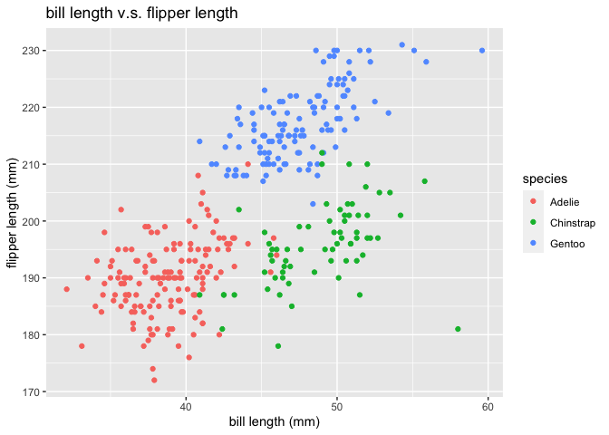

p8105_hw1_fy2297
================

# Problem 1

## description of the dataset

``` r
# get dataset using code provided
data("penguins", package = "palmerpenguins")
# make a new dataset without N/A values in flipper length column
penguins_new <- penguins[-c(4,272),]
# calculate the sizes of the new dataset
num_row <- nrow(penguins)
num_col <- ncol(penguins)
# calculate the mean of flipper length
mean_flipper <- mean(penguins_new$flipper_length_mm)
```

The name of the dataset is called penguins, and there are 8 different
variables. The size of the dataset is 8 \* 344, and the mean flipper
length is 200.9152047mm.

## scatterplot making

``` r
# run library first
library(tidyverse)
```

    ## ── Attaching packages ─────────────────────────────────────── tidyverse 1.3.2 ──
    ## ✔ ggplot2 3.3.6      ✔ purrr   0.3.4 
    ## ✔ tibble  3.1.8      ✔ dplyr   1.0.10
    ## ✔ tidyr   1.2.1      ✔ stringr 1.4.1 
    ## ✔ readr   2.1.2      ✔ forcats 0.5.2 
    ## ── Conflicts ────────────────────────────────────────── tidyverse_conflicts() ──
    ## ✖ dplyr::filter() masks stats::filter()
    ## ✖ dplyr::lag()    masks stats::lag()

``` r
# name axes for better future use
x_axis <- penguins_new$bill_length_mm
y_axis <- penguins_new$flipper_length_mm
plot = tibble(x = x_axis, y = y_axis)
# make a plot using ggplot
ggplot(plot,aes(x=x, y=y, color = "blue"))+geom_point()+labs(title = "bill length v.s. flipper length", x = "bill length (mm)",y = "flipper length (mm)")
```

<!-- -->

``` r
# save the plot just created
ggsave("bill length v.s. flipper length", plot = last_plot(), device = "pdf")
```

    ## Saving 7 x 5 in image

# Problem 2

``` r
set.seed(1234)
# create four different vectors
normal_vector <- rnorm(10)
logical_vector <- vector("logical", 10)
character_vector <- vector("character", 10)
    as.numeric(character_vector)
```

    ##  [1] NA NA NA NA NA NA NA NA NA NA

``` r
factor_vector <- factor(c("small","medium","large","small","medium","large","small","medium","large","small"))
    as.numeric(factor_vector)
```

    ##  [1] 3 2 1 3 2 1 3 2 1 3

``` r
# make a data frame using four vectors
df = tibble (normal_vector, logical_vector, character_vector, factor_vector)
# pull the variables out of the frame
data_norm <- pull(df, var = normal_vector)
data_logical <- pull(df, var = logical_vector)
data_character <- pull(df, var = character_vector)
data_factor <- pull(df, var = factor_vector)
# take the means of each variable
mean_norm <- mean(data_norm)
mean_logical <- mean(data_logical)
mean_character <- mean(data_character)
```

    ## Warning in mean.default(data_character): 参数不是数值也不是逻辑值：回覆NA

``` r
mean_factor <- mean(data_factor)
```

    ## Warning in mean.default(data_factor): 参数不是数值也不是逻辑值：回覆NA
